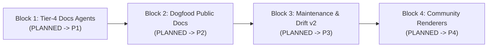

# Pageworks

Pageworks owns the public-facing documentation surface (`docs/`) of a project: scaffold, schema, page authoring, renderer export (MkDocs Material and Docusaurus), and drift maintenance as internal specs change.

## Active Campaign

### Campaign Blocks

1. **Block 1: Tier-4 Docs Agents (`P1`)**
   - **Capability Unlocked**: Pageworks can spawn focused `docs-writer` and `docs-reviewer` subagents to draft and review multi-page documentation batches.
   - **Prerequisites**: None.
   - **Status**: PLANNED (`.spectacular/proposals/P1-pageworks-agents.md`).

2. **Block 2: Dogfood Public Docs (`P2`)**
   - **Capability Unlocked**: Canonical public documentation site for Pageworks published to GitHub Pages using its own CLI export.
   - **Prerequisites**: Block 1.
   - **Status**: PLANNED (`.spectacular/proposals/P2-public-docs-dogfood.md`).

3. **Block 3: Maintenance & Drift v2 (`P3`)**
   - **Capability Unlocked**: `sync-ack` verb, multi-source `synced_from:`, screenshot freshness tracking, and content-hash drift detection.
   - **Prerequisites**: Block 2.
   - **Status**: PLANNED (`.spectacular/proposals/P3-pageworks-maintenance-v2.md`).

4. **Block 4: Community Renderers (`P4`)**
   - **Capability Unlocked**: Native adapters for Mintlify, Fumadocs, and additional site generators.
   - **Prerequisites**: Block 3.
   - **Status**: PLANNED (`.spectacular/proposals/P4-pageworks-renderers-more.md`).
