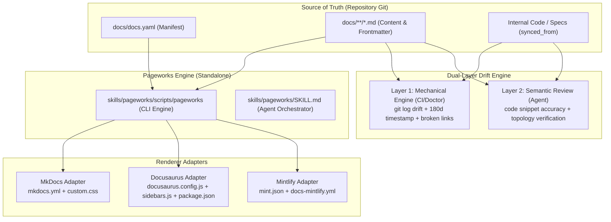
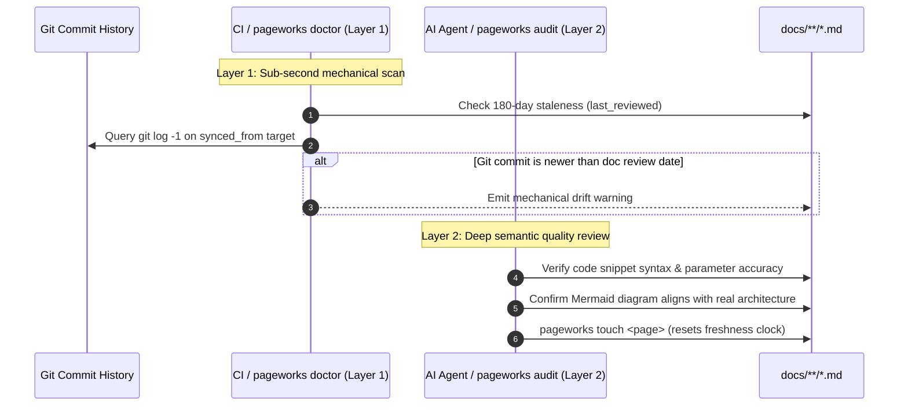

# Architecture Overview

Pageworks operates across four distinct distribution layers designed for zero runtime overhead in production, decoupling documentation authoring from static site generator tooling.

---

## 1. System Layers

1. **Convention Layer**:
   - Manifest: `docs/docs.yaml` declares section hierarchies, navigation ordering, and optional renderer hints.
   - Information Architecture: 6 standardized topic categories (`getting-started/`, `architecture/`, `services/`, `operations/`, `reference/`, `standards/`).
   - Signal Layer: YAML frontmatter contracts (`owner:`, `last_reviewed:`, `synced_from:`, `type:`) embedded on every page.
2. **Skill Layer**:
   - Lean orchestrator (`SKILL.md`) acting as a turn-0 router (~1.2k tokens).
   - Loads modular instructions (`references/*.md`) on demand to minimize context load.
3. **CLI Layer**:
   - Bundled zero-dependency Bash script (`skills/pageworks/scripts/pageworks`) symlinked to `cli/pageworks`.
   - Uses stream-based text parsing (`awk`, `sed`) to run in sub-50ms across macOS and Linux with zero Node or Python host runtime prerequisites.
4. **Plugin Layer**:
   - Standard manifests (`plugin.json`, `.claude-plugin/plugin.json`, `.codex-plugin/plugin.json`) for turnkey marketplace installation.

---

## 2. Renderer Adapter Pipeline

Pageworks treats documentation as pure Markdown data. Adapters transform `docs.yaml` navigation and site metadata into framework-specific configurations:

- **MkDocs Material Adapter (`pageworks export mkdocs`)**:
  - Generates `mkdocs.yml` configured with Lunr.js offline search, code tabs, copy buttons, and Mermaid superfences.
  - Generates `docs/stylesheets/custom.css` injecting custom branding variables.
  - Generates `.github/workflows/docs.yml` for GitHub Pages artifact deployment.
- **Docusaurus v3+ Adapter (`pageworks export docusaurus`)**:
  - Generates `docusaurus.config.js` in root docs mode (`routeBasePath: '/'`) with `@docusaurus/theme-mermaid` and GitHub topbar navigation.
  - Generates `sidebars.js` grouping category items.
  - Generates `package.json` with React 18 and core dependencies, and `src/css/custom.css`.
- **Mintlify Adapter (`pageworks export mintlify`)**:
  - Generates `mint.json` matching Mintlify's navigation grouping schema with branding color anchors and topbar links.
  - Generates `.github/workflows/docs-mintlify.yml` executing `npx mintlify broken-links`.

---

## 3. Dual-Layer Stale Docs Checking

To prevent documentation decay ("docs rot"), Pageworks splits maintenance into two complementary tiers:

1. **Layer 1: Mechanical Engine (`pageworks doctor` & CI)**:
   - Evaluates deterministic invariants in <10ms: 180-day freshness clocks, broken internal links, folder depth $\le 3$.
   - **Upstream Git Drift**: Inspects `git log -1 --format=%cs` on files specified in `synced_from:`. Flags an automatic warning when upstream source files have commits newer than the doc's last review.
2. **Layer 2: Skill-Driven Semantic Review (`/pageworks audit` in Agent)**:
   - Audits behavioral accuracy, runnable command flags, and Mermaid topology against actual code changes.
   - Bumps the freshness clock in sub-10ms via `pageworks touch <page>` once verified.

## Next

- [ADR 0001: Spectacular v2 Migration](0001-spectacular-v2-migration.md) — Architectural decision history.
- [Export Runbook](../operations/export-runbook.md) — Operational procedures for static exports.
