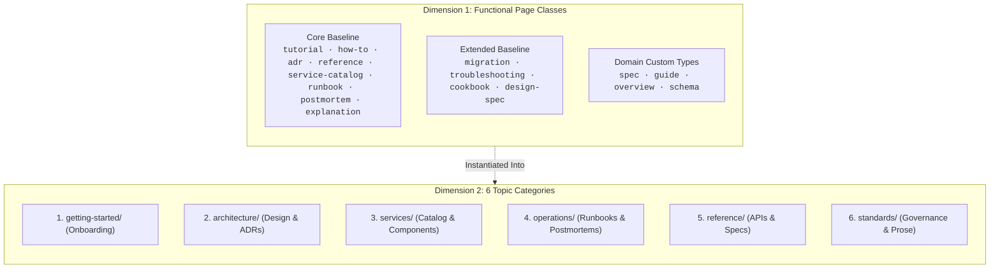

# Core Concepts

Pageworks organizes public-facing documentation along two orthogonal axes: **Functional Page Classes** (what format a document takes) and **Topic Categories** (where it lives in the information architecture).

---

## 1. Extensible Page Classes (Functional Format)

Every document in a software wiki serves a single clear cognitive purpose. Pageworks establishes an extensible inspiration baseline rather than a rigid schema:

### Core Baseline Classes
- **Tutorials (`type: tutorial`)**: Step-by-step onboarding walkthroughs focused on beginner success.
- **How-To Guides & Runbooks (`type: how-to`, `type: runbook`)**: Goal-oriented recipes for operational tasks and incident response.
- **Architecture Decision Records (`type: adr`)**: Immutable choice and trade-off records (Context $\to$ Decision $\to$ Consequences).
- **Technical Reference Specs (`type: reference`)**: Pure factual API contracts, schemas, and CLI parameter manuals.
- **Service Catalog One-Pagers (`type: service-catalog`)**: Microservice definitions, tier classifications, owners, SLOs, and endpoints.
- **Incident Postmortems (`type: postmortem`)**: Blameless retrospectives, root-cause analyses (5 Whys), and timeline action items.
- **Explanations (`type: explanation`)**: Deep architectural overviews, system topology narratives, and design rationales.

### Extended Format Templates
- **Migration Guides (`type: migration`)**: Upgrade readiness checklists, breaking changes tables, and legacy-to-modern syntax diffs.
- **Troubleshooting Guides (`type: troubleshooting`)**: Diagnostic matrix with 3-column Symptom $\to$ Root Cause $\to$ Resolution mapping.
- **Integration Cookbooks (`type: cookbook`)**: End-to-end runnable recipes with multi-language tabs and verification curl commands.
- **Design Specifications (`type: design-spec`)**: Visual anatomy callouts, design token tables, and WCAG AA accessibility specs.

> [!NOTE]
> Custom domain types (`type: my-custom-type`) are fully supported: `pageworks doctor` emits an informative notice rather than a warning.

---

## 2. Topic Categories (Information Architecture)

The filesystem and navigation sidebars are structured into 6 predictable top-level categories:

1. `getting-started/` — Prerequisites, installation, and zero-to-running onboarding.
2. `architecture/` — System topology, component boundaries, and ADRs.
3. `services/` — Service catalog entries, APIs, and dependencies.
4. `operations/` — Operational runbooks, release procedures, and incident retrospectives.
5. `reference/` — CLI manuals, configuration schemas, and data specifications.
6. `standards/` — Engineering conventions, writing guidelines, and PR review checklists.

---

## 3. The Docs-as-Code Model

All documentation is stored as portable Markdown in Git alongside application code. Pageworks decouples your source content from any single static site generator:

- **Agnostic Markdown**: Pure GFM with standard frontmatter metadata (`owner:`, `last_reviewed:`, `synced_from:`).
- **Multi-Renderer Adapters**: Export with zero manual rewrites to **MkDocs Material** (instant Python SSG), **Docusaurus v3+** (React/MDX SPA), or **Mintlify** (modern cloud dev portal).
- **Dual-Layer Maintenance**: Automated mechanical checks in CI (`pageworks doctor`) paired with semantic reviews in AI coding agents (`pageworks review` & `pageworks audit`).

## Next

- [Quickstart Walkthrough](quickstart.md) — Scaffold and export your first docs site.
- [CLI Reference](../reference/cli-reference.md) — Explore the commands and flags.
