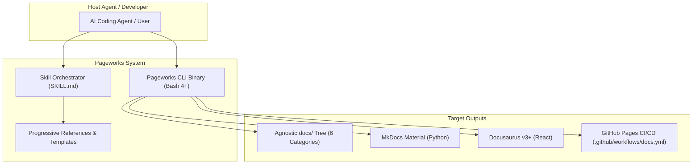

# Pageworks Documentation

Welcome to the **Pageworks** software and platform documentation. Pageworks is an AI agent skill and CLI tool designed to own a project's public-facing documentation surface (`docs/`) end-to-end: scaffold, schema, authoring, renderer export (MkDocs Material, Docusaurus v3+, Docker), and 180-day stale-page drift maintenance.

## System Overview & Ownership

| Property | Value |
|---|---|
| **Owning Team** | Platform Core (`@platform-core`) |
| **Slack Channel** | `#dev-pageworks` |
| **Source Repository** | [github.com/alexsmedile/pageworks](https://github.com/alexsmedile/pageworks) |
| **Compatible With** | Claude Code, Codex, Antigravity, Spectacular $\ge$ 2.0.0 |
| **License** | MIT |

## System Topology & Architecture

## Quick Navigation

### 1. [Getting Started & Onboarding](getting-started/quickstart.md)
Prerequisites, installation commands, and a zero-to-running walkthrough.

### 2. [Architecture & System Design](architecture/overview.md)
System layers, renderer-agnostic contracts, and [ADR 0001: Spectacular v2 Migration](architecture/0001-spectacular-v2-migration.md).

### 3. [Services & Components](services/cli.md)
Catalog one-pagers for the [CLI Tool](services/cli.md) and the [Skill Engine](services/skill-engine.md).

### 4. [Operations & Reliability](operations/export-runbook.md)
Runbooks for [Renderer Exports](operations/export-runbook.md) and [180-Day Drift Audits](operations/maintenance-audit.md).

### 5. [API & Data Reference](reference/cli-reference.md)
Command-line manuals, `docs.yaml` schema specs, and page frontmatter contracts.

### 6. [Standards & Governance](standards/prose-guidelines.md)
Action-oriented writing standards, copy-paste ready code formats, and PR review checklists.
