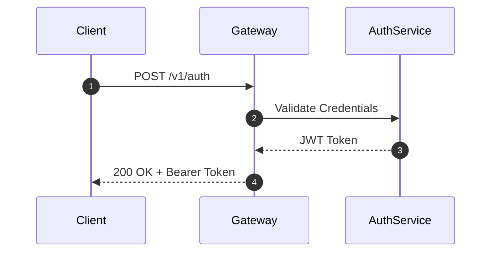

# Prose & Visual Standards

High-quality documentation minimizes cognitive friction, accelerates developer workflows, and provides unmistakable clarity.

---

## 1. Action-Oriented Imperative Headings

For procedural guides, onboarding tutorials, and runbooks, headings must use active imperative verbs describing the user's immediate operational step:

| ✗ Avoid (Passive / Informational) | ✓ Use (Action-Oriented / Imperative) |
|---|---|
| `## Configuration Information` | `## Configure Environment Variables` |
| `## Database Setup` | `## Initialize PostgreSQL Database` |
| `## Secret Rotation Process` | `## Rotate Production API Keys` |
| `## Verification Details` | `## Verify Service Health` |

- Keep headings concise: 2 to 6 words.
- Use sentence case (`## Configure environment variables`).
- Use noun-led headings for reference specs (`## Parameters`, `## Error Codes`).

---

## 2. "Punchline First" & Voice Standards

- **First-Sentence Rule**: The first sentence directly below any heading must deliver the immediate takeaway or outcome.
- **Active Voice**: *"Pageworks compiles the manifest"* instead of *"The manifest is compiled by Pageworks"*.
- **Direct Second Person**: Address the developer directly (*"Configure your API keys in `.env`"*).
- **Factual Over Marketing Hype**: Eliminate fluff words (*"ultra-fast"*, *"robust"*, *"seamless"*). State concrete, measurable metrics (*"p99 latency < 15ms"*, *"builds 500 pages in < 10s"*).

---

## 3. Copy-Paste Readiness & Command/Output Pairs

Every procedural snippet must follow a strict 2-part structure:
1. **The runnable command**: Clean of uncopyable `$` or `#` terminal prompts, with explicit uppercase `<PLACEHOLDER>` tokens.
2. **The expected return output**: Rendered in a separate block so users know immediately if their run succeeded.

```bash
# Set environment variables
export SERVICE_NAME="payment-gateway"
export NAMESPACE="production"

# Check deployment rollout status
kubectl rollout status deployment/${SERVICE_NAME} -n ${NAMESPACE}
```

```
deployment "payment-gateway" successfully rolled out
```

---

## 4. GitHub-Style Alert Callouts

Use GitHub-style alert callouts strategically to highlight critical caveats without burying them in paragraph text:

> [!NOTE]
> Background context, implementation details, or non-blocking tips.

> [!IMPORTANT]
> Essential requirements, required prerequisites, or must-know instructions.

> [!WARNING]
> Breaking changes, deprecation notices, or potential pitfalls.

---

## 5. 3-Column Troubleshooting Matrices

For operational runbooks and troubleshooting guides, structure common errors into scannable 3-column tables:

| Symptom | Root Cause | Resolution |
|---|---|---|
| `401 Unauthorized` | Expired OAuth token or missing `Bearer` prefix. | Re-authenticate using `auth login` or export `TOKEN="Bearer <key>"`. |
| `Connection refused: 5432` | PostgreSQL container not running locally. | Run `docker compose up -d db` and verify port binding with `docker ps`. |
| `Doctor warning: stale page` | Page has not been reviewed in $> 180$ days. | Verify accuracy and acknowledge freshness with `pageworks touch <page>`. |

---

## 6. Visuals Over Walls of Text

When explaining architectural flows, state transitions, or distributed pipelines, prefer native Mermaid.js diagrams over dense paragraphs:


