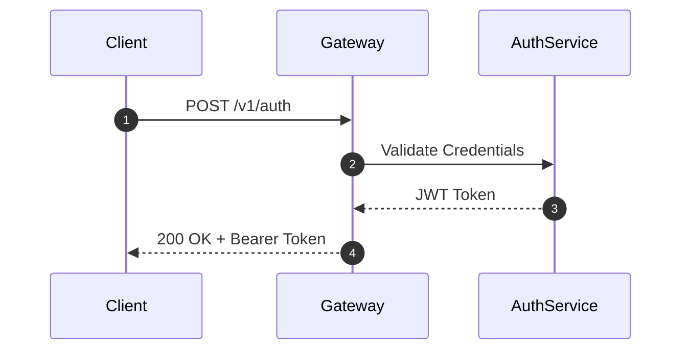

# Prose & Visual Standards

High-quality documentation minimizes cognitive friction and accelerates developer workflows.

## 1. Action-Oriented Imperative Headings

For tutorials and runbooks, headings must use active verbs describing the user's immediate action:
- **Do**: `## Configure Environment Variables`
- **Do Not**: `## Configuration Information`

## 2. Copy-Paste Readiness

- Never include terminal prompts (`$`, `#`, `>`) inside multi-line code blocks.
- Explicitly tag code fences with language identifiers (`bash`, `yaml`, `javascript`).
- Standardize all dynamic user inputs with uppercase angle brackets: `<YOUR_API_KEY>`, `<PORT>`.

## 3. Visuals Over Walls of Text

When explaining architectural flows or states, prefer native Mermaid.js diagrams over dense paragraphs:

