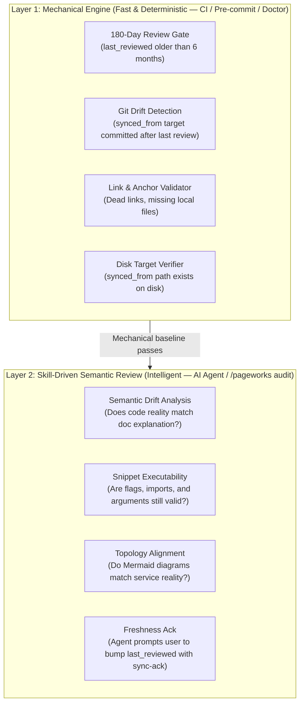

# Maintenance — Dual-Layer Stale Docs Checking, Drift Detection & Spec Sync

Use this when: Auditing 180-day stale pages, checking link health, discovering wiki rot, or reconciling docs after a spec or capability change.

---

## 1. The Dual-Layer Stale Docs Checking Architecture

Documentation maintenance requires two distinct verification engines operating at different layers:



### Layer 1: Mechanical Engine (`pageworks doctor` & CI)
- **Execution**: Sub-second deterministic checks run in CLI, pre-commit hooks, or GitHub Actions without LLM token cost.
- **Responsibilities**:
  1. **180-Day Trigger**: Flags any page with `last_reviewed:` or `updated:` $> 180$ days ago.
  2. **Upstream Git Drift**: Checks `git log -1 --format=%cs` on files declared in `synced_from:`. If the upstream source has git commits newer than the doc's `last_reviewed:` timestamp, a warning is raised.
  3. **Link & Anchor Resolution**: Verifies that internal Markdown links (e.g. `[label]` `(target)`) and `synced_from:` targets resolve to existing files on disk.
  4. **Hierarchy & Frontmatter**: Enforces $\le 3$-level folder depth and required metadata blocks.

### Layer 2: Skill-Driven Semantic Review (`/pageworks audit` in Agent)
- **Execution**: Invoked in AI agents (Antigravity, Claude Code, Codex) when reviewing documentation quality or during project handoffs.
- **Responsibilities**:
  1. **Semantic Drift**: Identifies code changes that altered underlying system behavior, API parameters, or defaults even if doc timestamps were recently touched.
  2. **Runnable Snippet Validation**: Inspects code examples to ensure flags, imports, and options actually match real implementations.
  3. **Visual & Topology Alignment**: Compares Mermaid system diagrams against actual service definitions, modules, or network manifests.
  4. **Freshness Acknowledgment**: When an agent confirms a page is accurate, it runs `pageworks touch <page>` to acknowledge freshness and reset the review clock in sub-10ms without modifying page prose.

---

## 2. Drift Types & Signals

| Drift Type | Signal | Engine Layer | Severity |
|---|---|---|---|
| **Stale Content (180-day rule)** | Page `last_reviewed:` or `updated:` is older than 180 days (6 months) | Layer 1 (Mechanical) | warning |
| **Missing Ownership** | Page has no `owner:` declared in frontmatter | Layer 1 (Mechanical) | warning |
| **Source-Spec Git Drift** | Page declares `synced_from:` and target git commit date > `last_reviewed:` | Layer 1 (Mechanical) | warning |
| **Missing Synced Target** | Page declares `synced_from:` target that does not exist on disk | Layer 1 (Mechanical) | error |
| **Broken Internal Link** | Target link destination does not exist on disk | Layer 1 (Mechanical) | error |
| **Semantic Behavior Drift** | Code implementation changed behavior without doc update | Layer 2 (Skill-Driven) | audit flag |
| **Snippet Stagnation** | Code blocks contain obsolete flags or invalid syntax | Layer 2 (Skill-Driven) | audit flag |
| **Diagram Mismatch** | Mermaid diagram reflects old service topology | Layer 2 (Skill-Driven) | audit flag |

---

## 3. The `synced_from:` Pattern

When a public doc page derives from an internal contract, spec, or code module (e.g. `.spectacular/contracts/CC-*.md` or `cli/pageworks`), declare the source in frontmatter:

```yaml
---
title: "CLI Commands Reference"
description: "Reference manual for all pageworks CLI verbs."
section: reference
type: reference
status: stable
owner: "@platform-cli"
last_reviewed: 2026-08-22
updated: 2026-08-22
synced_from: ../../../cli/pageworks
---
```

Pageworks automatically queries Git history: if `cli/pageworks` was committed after `2026-08-22`, `pageworks doctor` reports:
```
⚠️  docs/reference/cli-reference.md — upstream source '../../../cli/pageworks' modified in git since last review (14 day(s) drift)
```

### Recognized Spec Sources
1. Spectacular Core Anchors: `PROJECT.md`, `STACK.md`, `ARCHITECTURE.md`
2. Spectacular Capability Contracts: `.spectacular/contracts/CC-*.md`
3. OpenAPI / JSON Schemas: `schemas/*.json`, `openapi.yaml`
4. Code Modules & CLI binaries: `cli/*`, `src/*`

---

## 4. Maintenance Flow in Agent Sessions

```text
Code or Spec Change in Project
  └─► Layer 1: Git-hook or CI flags modified upstream files
        └─► Layer 2: Agent runs /pageworks audit
              └─► Read source diff & inspect doc page
                    ├─► Page drifted? Update text, bump updated & last_reviewed
                    └─► False positive / Still accurate? Run 'pageworks touch <page>'
```
