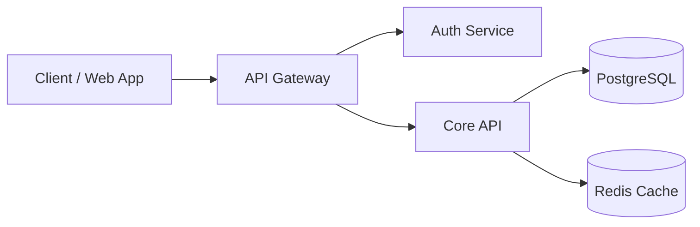

# Prose Patterns & Writing Standards

Use this when: Authoring documentation prose, formatting copy-paste ready code blocks, writing action-oriented headings, or creating Mermaid diagrams.

The shared writing, formatting, and design standards across all documentation pages: voice, tone, structure, action-oriented headings, copy-paste fidelity, and diagrams.

---

## 1. Action-Oriented Headings

**Imperative verbs for procedural documentation.** Readers scan for actions, not abstract categories.

| ✗ Avoid (Passive / Informational) | ✓ Use (Action-Oriented / Imperative) |
|---|---|
| `## Configuration Info` | `## Configure Environment Variables` |
| `## Database Setup` | `## Initialize PostgreSQL Database` |
| `## Authentication Flow` | `## Authenticate with API Gateway` |
| `## Secret Rotation Process` | `## Rotate Production API Keys` |
| `## Verification Details` | `## Verify Service Health` |

- Keep headings concise: 2 to 6 words.
- Use sentence case (`## Configure environment variables`).
- Use noun-led headings for reference pages (`## Parameters`, `## Error Codes`).

---

## 2. Copy-Paste Readiness & Code Standards

Every code and CLI snippet must be syntactically valid, functional, and copy-paste friendly.

### Rules:
1. **Always declare language and shell environment**: Specify `bash`, `zsh`, `json`, `yaml`, `typescript`, etc.
2. **Drop uncopyable `$` prompt symbols** in multi-line or standard command blocks so users can click "copy" and run immediately.
3. **Standardize placeholders**: Use explicit uppercase angle-bracket placeholders (`<YOUR_API_KEY>`, `<SERVICE_NAME>`, `<NAMESPACE>`) or standard environment variables (`export SERVICE_PORT=8080`).
4. **Annotate outputs in separate blocks**: Separate commands from expected outputs.

```bash
# Set required environment variables
export SERVICE_NAME="auth-service"
export TARGET_NAMESPACE="staging"

# Execute rollout
kubectl rollout restart deployment/${SERVICE_NAME} -n ${TARGET_NAMESPACE}
```

```
deployment.apps/auth-service restarted
```

---

## 3. Visuals Over Walls of Text

Include lightweight diagrams (Mermaid.js charts, sequence diagrams, C4 models) for data flows, system topologies, and component interactions.

### Standard Diagrams:
- **System Topology & C4 Container Model**: Use `flowchart TD` or `flowchart LR`.
- **Async Messaging & Pipelines**: Show publishers, event brokers, and subscribers.
- **Request / Response Life Cycles**: Use `sequenceDiagram`.



---

## 4. Voice and Tone

- **Active voice over passive**: *"Pageworks compiles the configuration"* vs *"The configuration is compiled by Pageworks"*.
- **Direct second person**: Address the developer directly (*"Configure your API keys in `.env`"*).
- **Factual over marketing hype**: Eliminate fluff words (*"robust"*, *"seamless"*, *"ultra-fast"*, *"best-in-class"*). State measured metrics (*"p99 latency < 15ms"*).
- **No apologies or self-deprecating prose**: Explain how to resolve complexity without dwelling on it.
- **First-sentence rule**: The first sentence of every paragraph must carry the core takeaway.

---

## 5. Frontmatter Governance

- **Explicit Ownership**: Every page must declare an `owner:` (e.g. `@platform-team`, `#oncall-sre`).
- **Review Dates**: Maintain `updated:` and `last_reviewed:` dates. Stale content ($> 180$ days) triggers audit warnings.
