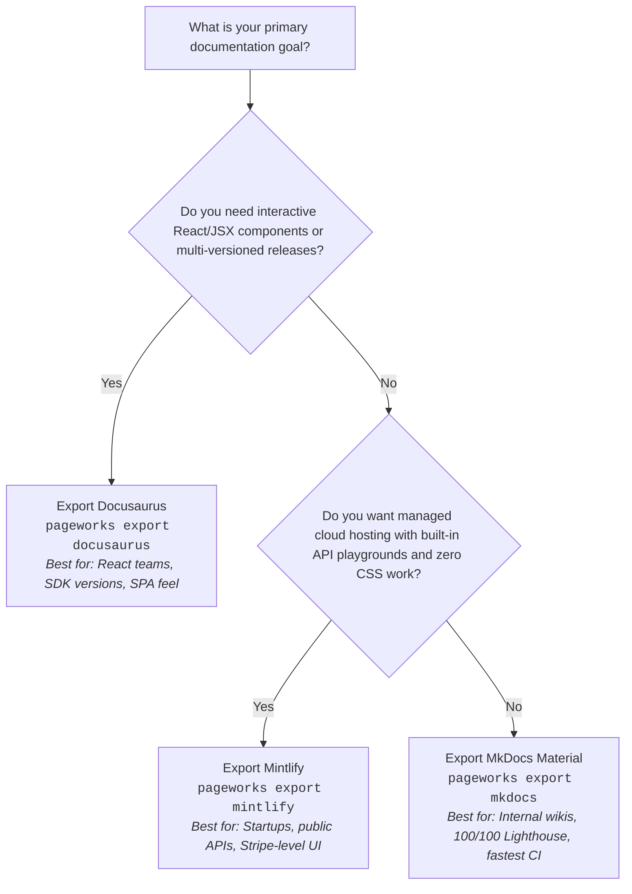

# Renderers & Wiki Platforms — Architecture, SSGs, and Self-Hosted Wikis

Use this when: Exporting to MkDocs, Docusaurus, or Docker, configuring renderer pipelines in docs.yaml, or selecting a Docs-as-Code SSG vs Collaborative Wiki platform.

---

## 1. The Platform Landscape: Docs-as-Code vs. Collaborative Wikis

The right documentation platform depends on team workflows:

| Platform | Type / Engine | Best For | Key Strengths & Trade-offs |
|---|---|---|---|
| **MkDocs (Material)** | Docs-as-Code (Python) | Internal engineering docs, APIs, runbooks | **Zero JS overhead**, instant client-side search, tabs, Mermaid diagrams, lowest configuration barrier. |
| **Docusaurus (v3+)** | Docs-as-Code (Node / React) | Public developer portals & product docs | **React/MDX ecosystem**, multi-versioning (v1 vs v2), i18n, custom JSX components in Markdown. |
| **Mintlify** | Modern Dev Portal (Cloud / CLI) | High-growth startups, APIs, platform SDKs | **Stripe-level aesthetics out-of-the-box**, interactive API playgrounds, MDX components, zero config web app. |
| **Starlight (Astro)** | Docs-as-Code (Astro / Vite) | High-performance developer docs | Exceptionally fast load times, minimal client JS footprint, built-in search and MDX support. |
| **Scalar / Redoc** | Specialized API Documentation | OpenAPI / Swagger-first platforms | Turns OpenAPI JSON/YAML into interactive, searchable API reference portals with mock request builders. |
| **Docmost** | Self-Hosted Wiki (Node / AGPL-3.0) | Cross-functional team wiki | Real-time collaborative rich editor, nested spaces, user permissions, simple Docker Compose deploy. |
| **Outline** | Self-Hosted Wiki (Node / Source-avail) | Notion-like engineering & product wiki | Clean block-based Markdown editor, fast UI, team permissions (requires SSO/OIDC like Google/Okta). |
| **BookStack** | Self-Hosted Wiki (PHP / Laravel) | Operational & non-technical teams | Enforced 4-level structure (Shelves $\to$ Books $\to$ Chapters $\to$ Pages), simple WYSIWYG/Markdown. |
| **Wiki.js** | Self-Hosted Wiki (Node / Vue) | Hybrid teams wanting Git sync | 2-way Git synchronization, multiple auth backends, modular search engines (Elasticsearch, PostgreSQL). |

### Quick Decision Matrix

- **Need zero JS, instant search, tabs & Mermaid out-of-the-box?** $\to$ **MkDocs Material** (`pageworks export mkdocs`)
- **Need React/MDX components, multi-versioning, or custom UI layouts?** $\to$ **Docusaurus** (`pageworks export docusaurus`)
- **Need modern Stripe-like portal aesthetics & automated link verification?** $\to$ **Mintlify** (`pageworks export mintlify`)
- **Need zero-install local container preview?** $\to$ **Docker**
- **Need collaborative browser WYSIWYG for non-technical teams?** $\to$ **Docmost / Outline / BookStack**

---

---

## 2. Deep Dive: MkDocs (Material) vs. Docusaurus (v3+) vs. Mintlify

All three supported export targets follow the **Docs-as-Code** philosophy: Markdown content stored in Git alongside application code, compiled into production assets, and deployed via automated CI/CD pipelines.

### Architectural Comparison

| Layer | MkDocs (Material Theme) | Docusaurus (v3+) | Mintlify |
|---|---|---|---|
| **Language / Engine** | Python (Jinja2 templating) | Node.js (Webpack 5 + React 18) | Next.js / Edge hybrid (Cloud CLI) |
| **Frontend Architecture** | Server-rendered MPA with vanilla JS | Single Page App (SPA) with React hydration | Server-rendered React / Edge SPA |
| **Server Runtime** | **None in production** (pure static HTML/CSS) | **None in production** (static HTML + JS bundles) | Managed Edge CDN / Serverless |
| **Content Format** | CommonMark / GFM + Python-Markdown extensions | MDX v3 (`.md` and `.mdx` with embedded JSX) | MDX with built-in UI components |
| **Search Engine** | Built-in Lunr.js / Web Workers (offline, zero-config) | Local search plugin or Algolia DocSearch | Cloud-indexed instant search |
| **Customization** | YAML config overrides, CSS variables, Jinja2 blocks | React component shadowing, JSX layouts, CSS modules | `mint.json` schema, custom domain & styling |

---

### Empirical Performance Benchmarks & Trade-Offs

Empirical benchmark data compiled across real-world documentation suites (HTTP Archive, Astro Starlight ecosystem benchmarks, and CI profiling):

| Metric | **MkDocs (Material)** | **Docusaurus (v3+)** | **Mintlify** | **Astro Starlight** *(Ecosystem Baseline)* |
|---|---|---|---|---|
| **Generator Export (`pageworks export`)** | **~50 ms** | **~52 ms** | **~46 ms** | N/A |
| **Cold Build Time (100 pages)** | **~1.5s – 3s** | **~8s – 14s** | Instant (Cloud) | **~1.2s – 2s** |
| **Cold Build Time (1,000 pages)** | **~18s – 35s** | **~45s – 2m 10s** | Managed Cloud | **~12s – 22s** |
| **CI Install & Build Overhead** | **~15s – 25s** (pip cache) | **~45s – 90s** (npm cache + Webpack) | **~10s** (link check only) | **~20s – 35s** |
| **Initial JS Shipped to Client** | **~35 KB – 50 KB** | **~180 KB – 320 KB** (React + chunks) | **~120 KB – 180 KB** | **~5 KB – 15 KB** |
| **First Contentful Paint (FCP)** | **~0.3s – 0.5s** | **~0.7s – 1.1s** | **~0.5s – 0.8s** | **~0.3s – 0.4s** |
| **Time to Interactive (TTI - Mobile 4G)**| **< 0.5s** | **1.5s – 2.8s** (React hydration) | **~1.0s – 1.5s** | **< 0.5s** |
| **In-Session Page Transition** | MPA reload / PJAX (~150ms) | **Instant SPA transition (< 40ms)** | Fast client router (~60ms) | MPA / Client router (~80ms) |
| **Lighthouse Mobile Score** | **98 – 100 / 100** | **78 – 90 / 100** | **90 – 95 / 100** | **99 – 100 / 100** |
| **Out-of-Box Offline Search** | **Built-in** (zero config) | Plugin required (`docusaurus-search-local`) | Cloud indexed | **Built-in Pagefind** |

---

### Plausible Choices & Strategic Rationales

#### 1. Why Choose Docusaurus (v3+)?
*Target Scenario: Developer platforms, commercial SaaS, SDKs, and engineering portals with React teams.*

- **Plausible Reasons to Choose:**
  - **Embedded React / MDX**: If your documentation requires live, interactive client components (e.g., interactive token calculators, authentication key pickers, sandbox API testers, or tabbed code runtimes), Docusaurus executes React JSX directly inside `.md` files.
  - **Industry-Standard Multi-Versioning**: Docusaurus has the most robust versioning system in the docs-as-code space (`npm run docusaurus docs:version 2.0.0`). It snapshots previous doc versions, maintains isolated navigation trees, and generates version dropdowns with zero manual URL rewrites.
  - **Fluid Single Page App (SPA) UX**: Once hydrated, internal page transitions are instantaneous (<40ms) with background chunk prefetching. Browsing feels like using a native desktop application.
  - **Theme Swizzling**: Teams can eject and customize any UI element (`DocItem`, `Navbar`, `Footer`) using standard React component shadowing.
- **Trade-Offs to Accept:**
  - Longer build times in CI (Webpack transpilation of React components).
  - Higher client-side JavaScript payload (~200KB+) leading to lower mobile Lighthouse scores due to hydration time.

#### 2. Why Choose MkDocs (Material)?
*Target Scenario: Internal engineering documentation, platform runbooks, architecture wikis, and high-volume reference docs.*

- **Plausible Reasons to Choose:**
  - **Zero-Latency Initial Load & 100/100 Lighthouse**: Emits pure server-rendered static HTML with minimal vanilla JavaScript (~40KB). Ideal for global teams, low-bandwidth connections, and mobile devices.
  - **Blazing Fast CI Pipelines**: Python Markdown compilation avoids Node.js/Webpack overhead. Even a 500-page site builds in <10 seconds; full GitHub Actions deployment completes in under 25 seconds.
  - **Zero-Config Search & Diagramming**: Out-of-the-box Lunr.js web worker search and Mermaid diagram rendering work without configuring third-party plugins or cloud accounts.
  - **Minimal Maintenance**: Avoids npm dependency upgrades, lockfile conflicts, and Node runtime deprecations.
- **Trade-Offs to Accept:**
  - No interactive React/JSX components (custom interactivity requires vanilla JavaScript or web components).
  - Multi-versioning requires external plugins (`mike`) rather than built-in tooling.

#### 3. Why Choose Mintlify?
*Target Scenario: High-growth startups, public REST/GraphQL APIs, developer tools, and teams wanting zero-maintenance infrastructure.*

- **Plausible Reasons to Choose:**
  - **Stripe-Quality Design Out of the Box**: Ships pre-styled, typography-crafted components (hero headers, property tables, interactive request/response API playgrounds) without requiring dedicated design or CSS engineering.
  - **Managed Edge Deployment**: No build infrastructure to maintain. Pushing to GitHub triggers Mintlify’s cloud pipeline and propagates to edge CDNs within seconds.
  - **Automated Quality Checks**: `npx mintlify broken-links` validates internal cross-links and MDX syntax with near-zero latency in CI.
- **Trade-Offs to Accept:**
  - Vendor cloud coupling (managed web dashboard required for production hosting).
  - Less flexibility for deeply customized self-hosted infrastructure on air-gapped or internal corporate intranets.

---

### Decision Tree: Which Should You Export?



---

## 3. MkDocs (Material) Workflow

### 1. Export Command

```bash
bash "${PAGEWORKS_SKILL_DIR:-skills/pageworks}/scripts/pageworks" export mkdocs [--force]
```

### 2. Generated Configuration (`mkdocs.yml`)

```yaml
# Generated by pageworks export mkdocs
site_name: Platform Docs
site_description: Software & platform documentation
docs_dir: docs

theme:
  name: material
  palette:
    - scheme: default
      primary: indigo
      accent: indigo
      toggle:
        icon: material/brightness-7
        name: Switch to dark mode
    - scheme: slate
      primary: indigo
      accent: indigo
      toggle:
        icon: material/brightness-4
        name: Switch to light mode
  features:
    - navigation.instant
    - navigation.tracking
    - navigation.sections
    - navigation.expand
    - search.suggest
    - search.highlight
    - content.code.copy

markdown_extensions:
  - admonition
  - toc:
      permalink: true
  - pymdownx.highlight:
      anchor_linenums: true
  - pymdownx.superfences:
      custom_fences:
        - name: mermaid
          class: mermaid
          format: !!python/name:pymdownx.superfences.fence_code_format
  - pymdownx.tabbed:
      alternate_style: true

plugins:
  - search

nav:
  - Home: index.md
  - Getting Started:
      - Install: getting-started/install.md
      - Quickstart: getting-started/quickstart.md
```

### 3. Local Development & Build

```bash
# Install dependencies (Python pip or uv)
pip install mkdocs mkdocs-material

# Live reload development server (http://127.0.0.1:8000)
mkdocs serve

# Compile static production HTML/CSS to _site/
mkdocs build --strict --site-dir _site
```

### 4. Docker One-Liner Preview (Zero Python Install)

```bash
docker run --rm -it -p 8000:8000 -v "${PWD}:/docs" squidfunk/mkdocs-material
```

---

## 4. Docusaurus (v3+) Workflow

### 1. Export Command

```bash
bash "${PAGEWORKS_SKILL_DIR:-skills/pageworks}/scripts/pageworks" export docusaurus [--force]
```

### 2. Generated Files

#### `package.json`
```json
{
  "name": "docs",
  "version": "1.0.0",
  "private": true,
  "scripts": {
    "docusaurus": "docusaurus",
    "start": "docusaurus start",
    "build": "docusaurus build",
    "serve": "docusaurus serve"
  },
  "dependencies": {
    "@docusaurus/core": "^3.0.0",
    "@docusaurus/preset-classic": "^3.0.0",
    "@docusaurus/theme-mermaid": "^3.0.0",
    "clsx": "^2.0.0",
    "react": "^18.0.0",
    "react-dom": "^18.0.0"
  }
}
```

#### `docusaurus.config.js`
```javascript
// Generated by pageworks export docusaurus
module.exports = {
  title: 'Platform Docs',
  tagline: 'Technical documentation',
  url: 'https://org.github.io',
  baseUrl: '/repo/',
  onBrokenLinks: 'throw',
  onBrokenMarkdownLinks: 'warn',
  favicon: 'img/favicon.ico',
  organizationName: 'org',
  projectName: 'repo',
  trailingSlash: false,
  markdown: {
    mermaid: true,
  },
  themes: ['@docusaurus/theme-mermaid'],
  presets: [
    ['classic', {
      docs: {
        sidebarPath: require.resolve('./sidebars.js'),
        routeBasePath: '/', // Serve docs at root
      },
      theme: {
        customCss: require.resolve('./src/css/custom.css'),
      },
    }],
  ],
  themeConfig: {
    navbar: {
      title: 'Platform Docs',
      items: [
        {
          href: 'https://github.com/org/repo',
          label: 'GitHub',
          position: 'right',
        },
      ],
    },
  },
};
```

#### `sidebars.js`
```javascript
// Generated by pageworks export docusaurus
module.exports = {
  docs: [
    'index',
    {
      type: 'category',
      label: 'Getting Started',
      items: ['getting-started/install', 'getting-started/quickstart'],
    },
    {
      type: 'category',
      label: 'Architecture & System Design',
      items: ['architecture/overview'],
    },
  ],
};
```

### 3. Local Development & Build

```bash
# Install Node dependencies
npm install

# Start development server with React Fast Refresh (http://localhost:3000)
npm start

# Compile static production build to build/
npm run build
```

---

## 5. Mintlify Workflow

Mintlify is a modern developer documentation platform optimized for platform APIs, SDKs, and developer-first products. It pairs Stripe-level typography, interactive code tabs, and API playgrounds with Git-driven continuous deployment.

### 1. Export Command

```bash
# Export mint.json and GitHub Actions validation workflow
pageworks export mintlify

# Force overwrite if mint.json already exists
pageworks export mintlify --force
```

### 2. Generated Artifacts

Exporting generates `mint.json` at repository root and `.github/workflows/docs-mintlify.yml`.

#### `mint.json`
```json
{
  "$schema": "https://mintlify.com/schema.json",
  "name": "Platform Docs",
  "logo": {
    "dark": "/logo/dark.svg",
    "light": "/logo/light.svg"
  },
  "favicon": "/favicon.svg",
  "colors": {
    "primary": "#0D9373",
    "light": "#07C98B",
    "dark": "#0D9373"
  },
  "topbarLinks": [
    {
      "name": "Support",
      "url": "https://github.com/org/repo/issues"
    }
  ],
  "topbarCtaButton": {
    "name": "GitHub",
    "url": "https://github.com/org/repo"
  },
  "tabs": [
    {
      "name": "Documentation",
      "url": "docs"
    }
  ],
  "navigation": [
    {
      "group": "Getting Started",
      "pages": [
        "docs/getting-started/install",
        "docs/getting-started/quickstart"
      ]
    },
    {
      "group": "Architecture & System Design",
      "pages": [
        "docs/architecture/overview"
      ]
    }
  ],
  "footerSocials": {
    "github": "https://github.com/org/repo"
  }
}
```

### 3. Local Development & Preview

```bash
# Start local development server with live preview (http://localhost:3000)
npx mintlify dev

# Run broken link and syntax validation
npx mintlify broken-links
```

### 4. Hosting & Deployment

- **Mintlify Cloud App**: Connect your GitHub repository directly at [mintlify.com](https://mintlify.com). Every commit to `main` auto-deploys in seconds.
- **CI Validation**: `.github/workflows/docs-mintlify.yml` runs `npx mintlify broken-links` on PRs and pushes to verify internal links and syntax before merging.

---

## 6. Docker & Containerized Hosting

For self-hosted, air-gapped, or internal corporate networks:

### MkDocs Live Preview & Build (`Dockerfile`)

```dockerfile
FROM squidfunk/mkdocs-material:latest
WORKDIR /docs
COPY . .
EXPOSE 8000
ENTRYPOINT ["mkdocs"]
CMD ["serve", "--dev-addr=0.0.0.0:8000"]
```

### Static Production Hosting with Caddy/Nginx (`docker-compose.yml`)

```yaml
version: '3.8'
services:
  docs:
    image: caddy:2-alpine
    ports:
      - "8080:80"
    volumes:
      - ./_site:/usr/share/caddy:ro
    restart: unless-stopped
```

---

## 7. Automated GitHub Actions Deployment Workflow

Both adapters generate `.github/workflows/docs.yml` configured for GitHub Pages artifact deployment.

```yaml
# Generated by pageworks export
name: Deploy documentation
on:
  push:
    branches: [main]
    paths: ['docs/**', 'mkdocs.yml', 'docusaurus.config.js', 'sidebars.js', '.github/workflows/docs.yml']
  workflow_dispatch:

permissions:
  contents: read
  pages: write
  id-token: write

concurrency:
  group: pages
  cancel-in-progress: false

jobs:
  build:
    runs-on: ubuntu-latest
    steps:
      - uses: actions/checkout@v4
      - uses: actions/setup-python@v5
        with:
          python-version: '3.12'
      - run: pip install mkdocs mkdocs-material
      - run: mkdocs build --strict --site-dir _site
      - uses: actions/upload-pages-artifact@v3
        with:
          path: _site

  deploy:
    needs: build
    runs-on: ubuntu-latest
    environment:
      name: github-pages
      url: ${{ steps.deployment.outputs.page_url }}
    steps:
      - id: deployment
        uses: actions/deploy-pages@v4
```
