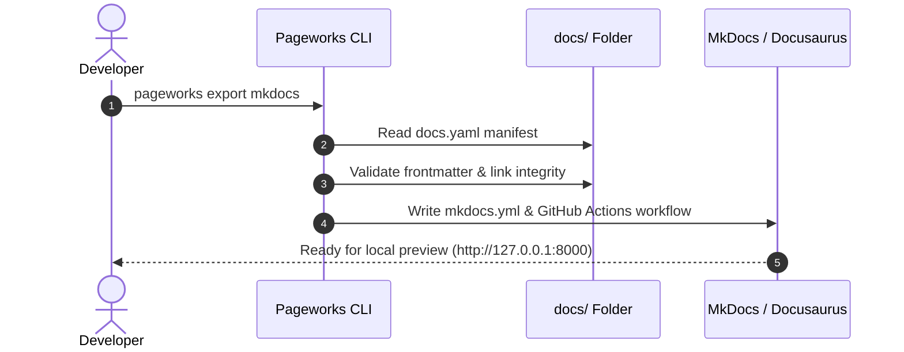

# Wiki Architecture & User-Facing Documentation Design Patterns

Use this when: Designing documentation information architecture, deconstructing page components, structuring landing pages, or applying industry-leading developer portal patterns (Stripe, Tailwind, Kubernetes, Cloudflare).

---

## 1. The Anatomy of World-Class Documentation

Top-tier developer portals and engineering wikis (Stripe, Tailwind CSS, Cloudflare, Next.js, Kubernetes) share specific structural components that eliminate cognitive friction:

```
┌────────────────────────────────────────────────────────────────────────┐
│  PAGE TITLE (Imperative Verb or Exact Noun)                           │
│  One-sentence plain English summary of what this page solves.          │
│  [Owner: @platform-core] [Reviewed: 2026-08-22] [Status: Stable]       │
├────────────────────────────────────────────────────────────────────────┤
│  > [!NOTE] Prerequisites & Verification Command                        │
│  - Tool X >= 18.0.0 (`node -v`) · Tool Y (`docker ps`)                 │
├────────────────────────────────────────────────────────────────────────┤
│  STEP 1 — IMPERATIVE ACTION HEADING (e.g. "Initialize Workspace")      │
│  ┌─ Tool / Language Tabs (npm · pnpm · yarn · curl) ────────────────┐ │
│  │  pnpm install                                                    │ │
│  └──────────────────────────────────────────────────────────────────┘ │
│  Expected Output Block:                                                │
│  └─► Success: 14 packages installed in 420ms                           │
├────────────────────────────────────────────────────────────────────────┤
│  SYSTEM TOPOLOGY / SEQUENCE (Mermaid Diagram)                          │
│  Client ──► Gateway ──► Service ──► Database                          │
├────────────────────────────────────────────────────────────────────────┤
│  FACTUAL SPECIFICATION TABLE                                           │
│  Parameter | Type | Required | Default | Description                   │
├────────────────────────────────────────────────────────────────────────┤
│  VERIFICATION & "WHAT JUST HAPPENED"                                   │
│  Concrete command to verify the system is working.                     │
├────────────────────────────────────────────────────────────────────────┤
│  NEXT STEPS / RELATED RUNBOOKS (No Dead Ends)                          │
│  → Configure Production Secrets · Set up CI/CD Deployment              │
└────────────────────────────────────────────────────────────────────────┘
```

---

## 2. The 8 Reusable Page Components

Every page in Pageworks is composed of these standardized, modular blocks:

### 1. Hero Block & Metadata Badge
- **H1**: Sentence-case, action-oriented for guides (`## Rotate production database credentials`), noun-led for references (`## API v2 Endpoints`).
- **Subtitle**: 1–2 plain-language sentences directly beneath H1 explaining the outcome.
- **Metadata**: YAML frontmatter rendered into scannable badges (`owner:`, `last_reviewed:`, `type:`).

### 2. Prerequisites Box
Never let a developer execute steps that will fail halfway through due to missing dependencies.
```markdown
> [!IMPORTANT]
> **Prerequisites**:
> - Node.js $\ge 20.0.0$ (verify with `node -v`)
> - Active Docker daemon (verify with `docker info`)
> - Cluster access token with `admin` scope
```

### 3. Multi-Tool / Language Tabs
Provide copy-paste syntax for all supported environments without cluttering the page with sequential code dumps.

```markdown
=== "pnpm"
    ```bash
    pnpm add @org/sdk
    ```

=== "npm"
    ```bash
    npm install @org/sdk
    ```

=== "yarn"
    ```bash
    yarn add @org/sdk
    ```
```

### 4. Copy-Paste Command & Expected Output Pairs
Every procedural snippet must follow a strict 2-part structure:
1. **The runnable command** (clean of uncopyable `$` prompts, with explicit `<PLACEHOLDER>` values).
2. **The expected return output** (so the user knows immediately if they succeeded).

```bash
curl -s -X POST https://api.example.com/v1/auth/tokens \
  -H "Authorization: Bearer <YOUR_API_KEY>" \
  -d '{"scope": "read:metrics"}'
```

```json
{
  "token": "tok_live_9948a8f",
  "expires_in": 3600,
  "status": "active"
}
```

### 5. Semantic Alert Callouts
Use alerts with surgical discipline:

| Callout | When to Use | Example |
|---|---|---|
| `> [!NOTE]` | Helpful context, background rationale, or platform nuance. | Default timeout is 30s. |
| `> [!TIP]` | Performance shortcuts, developer productivity tricks. | Use `--dry-run` to preview. |
| `> [!IMPORTANT]` | Critical prerequisites or mandatory operational constraints. | Must run from root folder. |
| `> [!WARNING]` | Breaking changes, service restarts, or high-risk actions. | Restarts active connections. |
| `> [!CAUTION]` | Irreversible data loss, secret exposure, or outage triggers. | Will wipe production DB. |

### 6. Interactive Mermaid Diagrams
Replace walls of ASCII or static images with maintainable Mermaid.js diagrams:
- **Topology & C4 Container Models**: `flowchart TD` or `flowchart LR`
- **Request Lifecycles & Handshakes**: `sequenceDiagram`
- **State Machines & Document Status**: `stateDiagram-v2`



### 7. Structured Data & Reference Tables
Factual information must be formatted as 5-column Markdown tables:

| Parameter | Type | Required | Default | Description |
|---|---|---|---|---|
| `timeout_ms` | `integer` | no | `5000` | HTTP request timeout in milliseconds. |
| `retries` | `integer` | no | `3` | Maximum retry attempts on network 5xx errors. |
| `api_key` | `string` | **yes** | — | Production authentication bearer key. |

### 8. The "No Dead Ends" Navigation Footer
Every tutorial, runbook, and ADR must conclude with links to the next logical steps:

```markdown
---

## Next Steps

- Link: Configure Secret Rotation Runbook -> operations/rotate-secrets.md
- Link: Review Service Catalog Specification -> services/auth-service.md
- Link: Inspect API v2 Schema Reference -> reference/api-v2.md
```

---

## 3. Information Architecture (IA) Guidelines

1. **The 30-Second Landing Page (`docs/index.md`)**:
   - Hero banner stating what the system does in 10 words.
   - 4 Card pathways: **Getting Started**, **System Topology**, **Services**, **Operational Runbooks**.
   - Owning team and real-time on-call channel handle.
2. **Shallow Hierarchy (Max Depth = 3)**:
   - Level 1: `docs/` (Root)
   - Level 2: `docs/<category>/` (One of the 6 Topic Categories)
   - Level 3: `docs/<category>/<page>.md` (The document itself)
3. **Domain / Capability Grouping**:
   - Group folders by domain (`auth-service/`, `billing/`, `storage/`) rather than volatile team names (`team-rocket/`). Teams reorganize; system boundaries endure.
