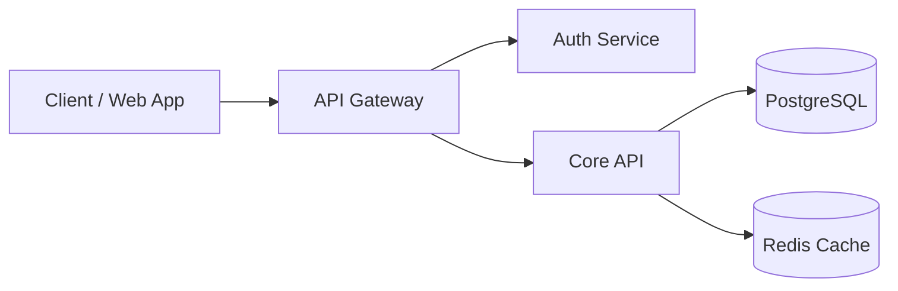

# Page Components — The 8 Standardized Developer Portal Blocks

Use this when: Identifying missing visual components in a Markdown page, formatting hero subtitles, designing multi-tool tabs, writing structured tables, or creating Mermaid diagrams.

---

## 1. Hero Block & Metadata Strip

Replaces conversational opening prose with an action-oriented title, 1-sentence value proposition, and metadata tags.

```markdown
# Run Local Development Environment

Scaffold, configure, and start the local development cluster with hot-reloading.

[Owner: @platform-core] [Last Reviewed: 2026-08-22] [Status: Stable] [Type: How-To]
```

---

## 2. Prerequisites & Verification Block

Placed immediately beneath the Hero block to guarantee the user has the required runtime environment before executing steps.

```markdown
> [!IMPORTANT]
> **Prerequisites**:
> - Node.js >= 20.0.0 (verify with `node -v`)
> - Active Docker daemon (verify with `docker info`)
> - Cluster access token with `admin` scope
```

---

## 3. Multi-Tool & Multi-Language Tabs

Presents copy-paste commands for multiple package managers or languages without vertical repetition.

### MkDocs Material Syntax
```markdown
=== "pnpm"
    ```bash
    pnpm add @org/sdk
    ```

=== "npm"
    ```bash
    npm install @org/sdk
    ```

=== "yarn"
    ```bash
    yarn add @org/sdk
    ```
```

### Docusaurus Syntax
```markdown
<Tabs>
  <TabItem value="pnpm" label="pnpm" default>
    ```bash
    pnpm add @org/sdk
    ```
  </TabItem>
  <TabItem value="npm" label="npm">
    ```bash
    npm install @org/sdk
    ```
  </TabItem>
</Tabs>
```

---

## 4. Copy-Paste Code & Expected Output Pairs

Every runnable command is stripped of `$` prompts, uses standard `<PLACEHOLDER>` values, and is paired with its expected output.

```bash
curl -s -X POST https://api.example.com/v1/auth/tokens \
  -H "Authorization: Bearer <YOUR_API_KEY>" \
  -d '{"scope": "read:metrics"}'
```

```json
{
  "token": "tok_live_9948a8f",
  "expires_in": 3600,
  "status": "active"
}
```

---

## 5. Semantic Alert Callouts

Replaces plain bold warnings with standard GitHub Flavored Markdown alerts:

| Alert | Visual Stance | Purpose |
|---|---|---|
| `> [!NOTE]` | ℹ️ Blue | Background context, implementation details, or platform nuance. |
| `> [!TIP]` | 💡 Green | Performance optimizations, shortcuts, or developer productivity tricks. |
| `> [!IMPORTANT]` | 🟣 Purple | Mandatory constraints or prerequisite environment checks. |
| `> [!WARNING]` | ⚠️ Amber | Breaking changes, service restarts, or high-risk operational steps. |
| `> [!CAUTION]` | 🛑 Red | High-risk actions causing irreversible data loss or security exposure. |

---

## 6. Interactive Mermaid Diagrams

Replaces static ASCII art or prose architecture descriptions with maintainable diagrams:



---

## 7. Structured 5-Column Reference Tables

Replaces bulleted parameter/flag lists with clean tabular specifications:

| Parameter | Type | Required | Default | Description |
|---|---|---|---|---|
| `timeout_ms` | `integer` | no | `5000` | HTTP request timeout in milliseconds. |
| `retries` | `integer` | no | `3` | Maximum retry attempts on network 5xx errors. |
| `api_key` | `string` | **yes** | — | Production authentication bearer key. |

---

## 8. "No Dead Ends" Navigation Footer

Concludes tutorials and runbooks with direct links to the next logical steps:

```markdown
---

## Next Steps

- Link: Configure Secret Rotation Runbook -> operations/rotate-secrets.md
- Link: Review Service Catalog Specification -> services/auth-service.md
- Link: Inspect API v2 Schema Reference -> reference/api-v2.md
```
