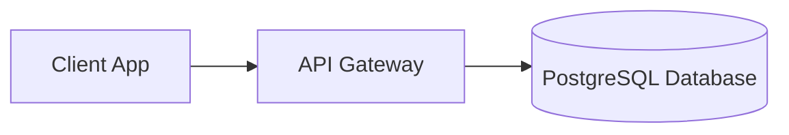

# Mechanical Transformation Recipes — From Raw Markdown to Developer Portal

Use this when: Executing specific prettification passes (hero, tabify, diagramify, tabulate, calloutify, codify, mesh) on a target Markdown file.

- Component specifications: [components.md](components.md)
- Quality gates & linters: [quality-gates.md](quality-gates.md)
- Designer styling tokens: [designer-mode.md](designer-mode.md)
- Target SSG platforms: [platforms.md](platforms.md)

---

## 1. Hero Pass (`prettify hero`)

### Before
```markdown
# Local Dev Setup
In this document we will talk about how you can get your local environment running and how to set up dependencies.
```

### After
```markdown
# Run Local Development Environment

Scaffold, configure, and initialize the local development cluster with hot-reloading.

[Owner: @platform-core] [Status: Stable] [Type: How-To]
```

---

## 2. Heading Refactor Pass (`prettify verbs`)

Converts passive or abstract headings into imperative action verbs:

| Raw Heading | Prettified Heading |
|---|---|
| `## Configuration Information` | `## Configure Environment Variables` |
| `## Database Setup` | `## Initialize PostgreSQL Database` |
| `## Secret Rotation Process` | `## Rotate Production API Keys` |
| `## Service Verification` | `## Verify Service Health` |

---

## 3. Tabify Pass (`prettify tabify`)

### Before
```markdown
Install via pnpm:
pnpm install

Or with npm:
npm install

Or with yarn:
yarn install
```

### After
```markdown
=== "pnpm"
    ```bash
    pnpm install
    ```

=== "npm"
    ```bash
    npm install
    ```

=== "yarn"
    ```bash
    yarn install
    ```
```

---

## 4. Diagramify Pass (`prettify diagramify`)

### Before
```text
+--------+        +-------------+        +------------+
| Client |  --->  | API Gateway |  --->  | PostgreSQL |
+--------+        +-------------+        +------------+
```

### After


---

## 5. Tabulate Pass (`prettify tabulate`)

### Before
```markdown
Parameters:
* `port` (number, optional, default 8080): Port to bind
* `host` (string, required): Host address to listen on
* `ssl` (boolean, optional, default false): Enable TLS
```

### After
```markdown
| Parameter | Type | Required | Default | Description |
|---|---|---|---|---|
| `host` | `string` | **yes** | — | Host address to listen on. |
| `port` | `number` | no | `8080` | Port to bind server. |
| `ssl` | `boolean` | no | `false` | Enable TLS encryption. |
```

---

## 6. Calloutify Pass (`prettify calloutify`)

### Before
```markdown
**Note:** The port must be open on your firewall.
**Warning!** Do not run this command against production without backing up data first!
```

### After
```markdown
> [!NOTE]
> Ensure the target port is open on your firewall.

> [!WARNING]
> Do not execute this command against production without performing a database snapshot first.
```

---

## 7. Codify Pass (`prettify codify`)

- Strips uncopyable `$` prefixes from terminal commands.
- Adds missing syntax highlighting language tags (`bash`, `yaml`, `json`).
- Replaces hardcoded personal keys with `<YOUR_API_KEY>`.
- Injects expected return outputs below the command block.
